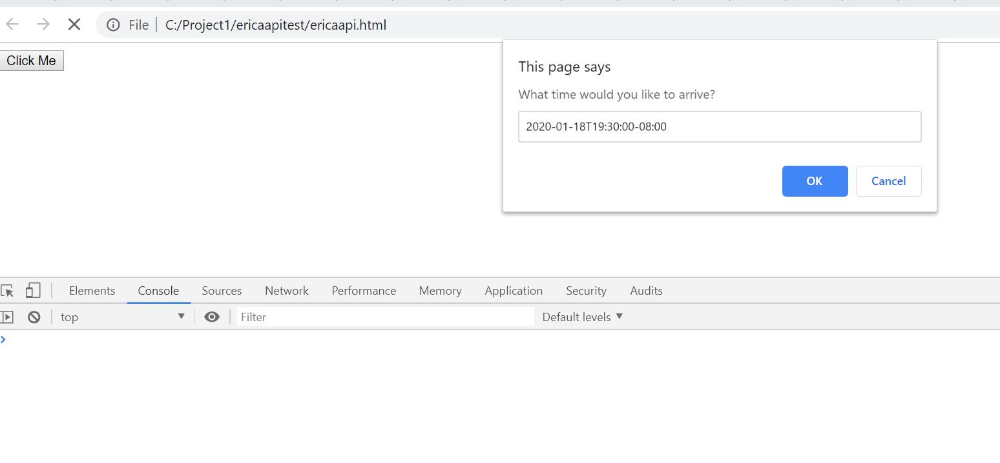
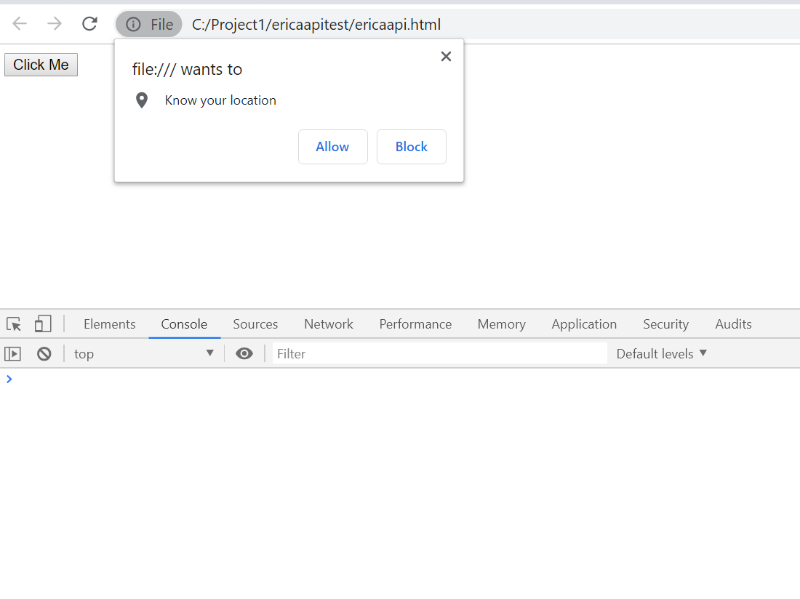
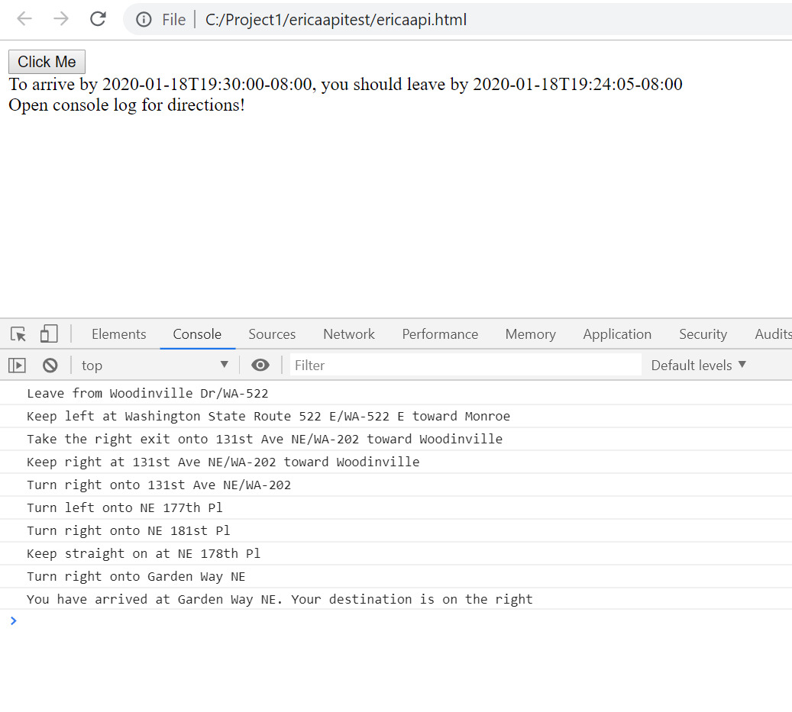

Prompt for arrive by time

Prompt for permission to use current location

Click button to see results

Goal: User inputs address and arrive by time, which returns the depart by time plus directions.

Current Status: With locationiq not commented, the geolocation is not returned quickly enough to process the tomtom query. All functions work independently. With locationiq commented out, the destination is hard-coded, user inputs arrive by time. Depart by time is returned plus directions (console log)

